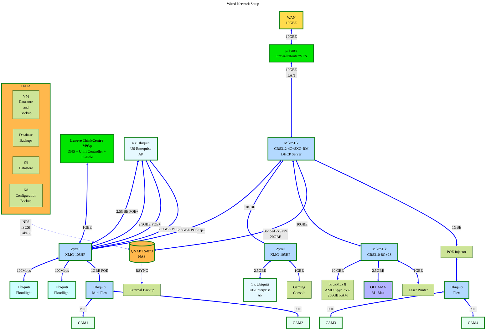

```mermaid
---
title: Wired Network Setup
---

%%{init: {'theme': 'forest', "loglevel":1,'themeVariables': {'lineColor': 'Blue', 'fontSize':'18px',"fontFamily": "Trebuchet MS"}}}%%

flowchart TD

    style G fill:#00e600,stroke:#13821a,stroke-width:4px
    style F fill:#e6f9ff,stroke:#13821a,stroke-width:4px
    style FA fill:#e6f9ff,stroke:#13821a,stroke-width:4px
    style B fill:#b3d9ff,stroke:#13821a,stroke-width:4px
    style QNAP fill:#ffb84d,stroke:#13821a,stroke-width:4px
    style DATA fill:#ffb84d,stroke:#13821a,stroke-width:4px
    style C fill:#b3d9ff,stroke:#13821a,stroke-width:4px
    style D fill:#b3d9ff,stroke:#13821a,stroke-width:4px
    style E fill:#b3d9ff,stroke:#13821a,stroke-width:4px
    style H fill:#b3d9ff,stroke:#13821a,stroke-width:4px
    style J fill:#b3d9ff,stroke:#13821a,stroke-width:4px
    style A fill:#00e600,stroke:#13821a,stroke-width:4px
    style FL1 fill:#ccffff,stroke:#13821a,stroke-width:4px
    style FL2 fill:#ccffff,stroke:#13821a,stroke-width:4px
    style CAM1 fill:#e6fff2,stroke:#13821a,stroke-width:4px
    style CAM2 fill:#e6fff2,stroke:#13821a,stroke-width:4px
    style CAM3 fill:#e6fff2,stroke:#13821a,stroke-width:4px
    style CAM4 fill:#e6fff2,stroke:#13821a,stroke-width:4px
    style Z fill:#ffdb4d,stroke:#13821a,stroke-width:4px
    style HB fill:#b3b3ff,stroke:#13821a,stroke-width:4px


    Z[WAN
    10GBE]

    A[pfSense
    Firewall/Router/VPN]

    B[Zyxel
    XMG-108HP]
    C[MikroTik
    CRS312-4C+8XG-RM
    DHCP Server]
    E[MikroTik
    CRS310-8G+2S]
    D[Zyxel
    XMG-105HP]
  
    F[1 x Ubiquiti
    U6-Enterprise
    AP]
    FA[4 x Ubiquiti
    U6-Enterprise
    AP]

    FC[POE Injector]
    G["`**Lenovo ThinkCentre M93p**`"
    DNS + Unifi Controller + Pi-Hole]
    H[Ubiquiti
    Mini Flex]
    J[Ubiquiti
    Flex]

    HC[Laser Printer]
    QNAP[(QNAP TS-873
    NAS)]
    HB[OLLAMA
    M1 Max]
    PS5[Gaming
    Console]
    FL1[Ubiquiti
    Floodlight]
    FL2[Ubiquiti
    Floodlight]
    CAM1[CAM1]
    CAM2[CAM2]
    CAM3[CAM3]
    CAM4[CAM4]


    BACKUP[External Backup]

    subgraph DATA[DATA]
        direction LR
        VM[VM
        Datastore
        and
        Backup]
        DB[Database 
        Backups]
        K8Storage[K8 
        Datastore]
        K8Config[K8
        Configuration
        Backup]
    end

    subgraph VMCLUSTER["ProxMox 8
        AMD Epyc 7532
        256GB RAM"]
    end


    Z <==10GBE==> A
    A <==10GBE
    LAN==> C

    C <==SFP+==> B
    B <==100Mbps==> FL1
    B <==100Mbps==> FL2
    C <==10GBE==> D
    C <==10GBE==> E
    C <==Bonded 2xSFP+
    20GBE==> QNAP

    G <==1GBE==> B
    D <==2.5GBE==> F
    E <==10 GBE==> VMCLUSTER
    E <==2.5GBE==> HB
    E <==1GBE==> HC

    C <==1GBE==> FC <==> J
    J <==POE==> CAM3
    J <==POE==> CAM4
    B <==1GBE POE==> H
    H <==POE==> CAM1
    H <==POE==> CAM2


    D <==1GBE==> PS5

    FA <==2.5GBE POE+==> B
    FA <==2.5GBE POE+==> B
    FA <==2.5GBE POE+==> B
    FA <==2.5GBE POE+==> B
    

   
    QNAP -.RSYNC.-> BACKUP
    DATA -.NFS
    iSCSI
    FakeS3.-> QNAP


    class blank subgraph_padding
    class blank1 subgraph_padding
```

