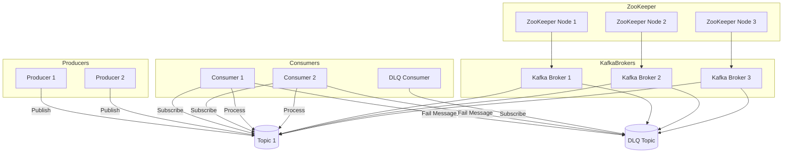

```mermaid
graph TD

    %% ZooKeeper nodes
    subgraph ZooKeeper
        zk1[ZooKeeper Node 1]
        zk2[ZooKeeper Node 2]
        zk3[ZooKeeper Node 3]
    end

    %% Kafka brokers
    subgraph KafkaBrokers
        broker1[Kafka Broker 1]
        broker2[Kafka Broker 2]
        broker3[Kafka Broker 3]
    end

    %% Producers and Consumers
    subgraph Producers
        producer1[Producer 1]
        producer2[Producer 2]
    end

    subgraph Consumers
        consumer1[Consumer 1]
        consumer2[Consumer 2]
        dlqConsumer[DLQ Consumer]
    end

    %% Topics
    topic1[(Topic 1)]
    topicDLQ[(DLQ Topic)]

    %% Relations
    producer1 -->|Publish| topic1
    producer2 -->|Publish| topic1
    consumer1 -->|Subscribe| topic1
    consumer2 -->|Subscribe| topic1
    consumer1 -->|Process| topic1
    consumer2 -->|Process| topic1
    consumer1 -->|Fail Message| topicDLQ
    consumer2 -->|Fail Message| topicDLQ
    dlqConsumer -->|Subscribe| topicDLQ

    %% Connections
    zk1 --> broker1
    zk2 --> broker2
    zk3 --> broker3
    broker1 --> topic1
    broker2 --> topic1
    broker3 --> topic1
    broker1 --> topicDLQ
    broker2 --> topicDLQ
    broker3 --> topicDLQ

    %% Labels
    classDef blue fill:#bbf,stroke:#333,stroke-width:2px;
    class ZooKeeper, KafkaBrokers,Producers,Consumersblue;

```