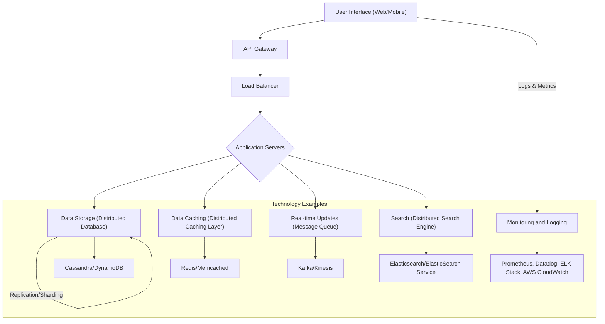

```mermaid
graph TD
    A["User Interface (Web/Mobile)"] --> B[API Gateway]
    B --> C[Load Balancer]
    C --> D{Application Servers}
    D --> E["Data Storage (Distributed Database)"]
    D --> F["Data Caching (Distributed Caching Layer)"]
    D --> G["Real-time Updates (Message Queue)"]
    D --> H["Search (Distributed Search Engine)"]
    A --"Logs & Metrics"--> I["Monitoring and Logging"]
    E --"Replication/Sharding"--> E

    subgraph "Technology Examples"
        E["Data Storage (Distributed Database)"] --> J["Cassandra/DynamoDB"]
        F["Data Caching (Distributed Caching Layer)"] --> K["Redis/Memcached"]
        G["Real-time Updates (Message Queue)"] --> L["Kafka/Kinesis"]
        H["Search (Distributed Search Engine)"] --> M["Elasticsearch/ElasticSearch Service"]
        I["Monitoring and Logging"] --> N["Prometheus, Datadog, ELK Stack, AWS CloudWatch"]
    end
```
