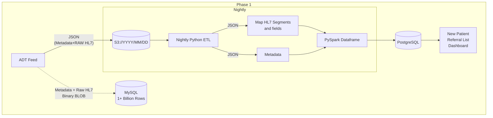

```mermaid
flowchart TD;
    subgraph "Phase 1"
        A["ADT Feed"] -. "Metadata + Raw HL7 
        Binary BLOB" .-> id1[("MySQL
        1+ Billion Rows")];
        A -- "JSON
        (Metadata+RAW HL7)" --> id2[(S3://YYYY/MM/DD)];
        subgraph "Nightly"
            id2 --> B["ETL"];
            B["Nightly Python ETL"] -- JSON --> C["Map HL7 Segments 
            and fields"];
            B["Nightly Python ETL"] -- JSON --> D["Metadata"];
            C --> E
            D --> E["PySpark Dataframe"]
        end
        E --> F[("PostgreSQL")]
        F --> L["New Patient 
        Referral List
        Dashboard"]
    end
```