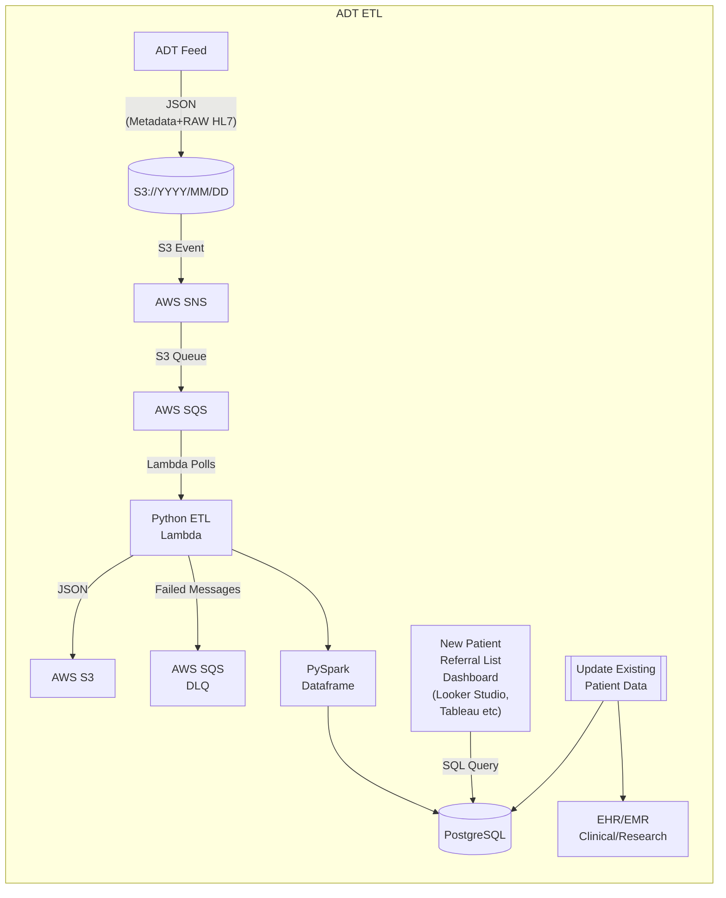

```mermaid
flowchart LR
    subgraph "ADT ETL"

        A["ADT Feed"] -- "JSON
        (Metadata+RAW HL7)" --> id2[(S3://YYYY/MM/DD)];
        id2 -- S3 Event --> sns["AWS SNS"]
        sns -- S3 Queue --> sqs["AWS SQS"]
        sqs -- Lambda Polls --> py["Python ETL
        Lambda"]
        py -- JSON --> s3["AWS S3"]
        py -- "Failed Messages" --> dlq["AWS SQS
        DLQ"]
        py  --> F["PySpark
        Dataframe"]
        F --> G[("PostgreSQL")]
        L["New Patient 
        Referral List
        Dashboard
        (Looker Studio, 
        Tableau etc)"] -- SQL Query --> G
        H[["Update Existing
        Patient Data"]] --> I["EHR/EMR
        Clinical/Research"]
        H --> G
    end
```
