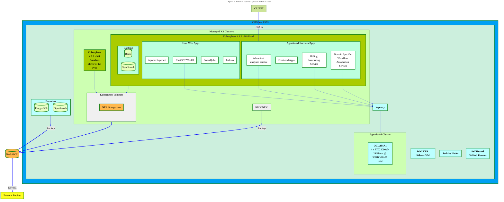

```mermaid
---
title: Agentic AI Platform as a Service/Agentic-AI-Platform-in-a-Box
---

%%{init: {'theme': 'forest', "loglevel":1,'themeVariables': {'lineColor': 'Blue', 'fontSize':'28px',"fontFamily": "Trebuchet MS"}}}%%

graph
    %% Styles
    style GPU1 fill:#bbffff,stroke:#13821a,stroke-width:4px
    style ESXI fill:#00a0f3,stroke:#13821a,stroke-width:4px
    style CACHING fill:#bbffdd,stroke:#13821a,stroke-width:4px
    style KS1 fill:#aacc00,stroke:#13821a,stroke-width:4px
    style KS2 fill:#aacc00,stroke:#13821a,stroke-width:4px
    style K8STORAGE fill:#f0f0f0,stroke:#13821a,stroke-width:4px
    style K8CONFIG fill:#f0f0f0,stroke:#13821a,stroke-width:4px
    style QNAP fill:#ffb84d,stroke:#13821a,stroke-width:4px
    style NFS fill:#ffb84d,stroke:#13821a,stroke-width:4px
    style PSQL fill:#ffaa,stroke:#13821a,stroke-width:4px
    style OPENSEARCH fill:#ffaa,stroke:#13821a,stroke-width:4px
    style REDIS fill:#ffaa,stroke:#13821a,stroke-width:4px
    style ELASTIC fill:#ffaa,stroke:#13821a,stroke-width:4px
    style DOCKER fill:#bbffff,stroke:#13821a,stroke-width:4px
    style JENKINSNODE fill:#bbffff,stroke:#13821a,stroke-width:4px
    style GITHUBRUNNER fill:#bbffff,stroke:#13821a,stroke-width:4px
    style APPS fill:#bbffdd,stroke:#13821a,stroke-width:4px
    style SUPERSET fill:#ffffff,stroke:#13821a,stroke-width:4px
    style ChatGPTUI fill:#ffffff,stroke:#13821a,stroke-width:4px
    style SONAR fill:#ffffff,stroke:#13821a,stroke-width:4px
    style JENKINS fill:#ffffff,stroke:#13821a,stroke-width:4px
    style BACKUP fill:#ff0d,stroke:#13821a,stroke-width:4px
    style VMS fill:#ccefdd,stroke:#13821a,stroke-width:4px
    style LLMAPPSK8 fill:#bbffdd,stroke:#13821a,stroke-width:4px
    style RedditScraper fill:#ffffff,stroke:#13821a,stroke-width:4px
    style FE fill:#ffffff,stroke:#13821a,stroke-width:4px
    style MedBillingForecast fill:#ffffff,stroke:#13821a,stroke-width:4px
    style VariousWorkflowAutomation fill:#ffffff,stroke:#13821a,stroke-width:4px
    style HAPROXY fill:#bbffff,stroke:#13821a,stroke-width:4px
    style DATASTORE fill:#bbffff,stroke:#13821a,stroke-width:4px

    classDef subgraph_padding fill:none,stroke:none
    
    %% NAS and External Backup
    QNAP[(NAS/iSCSI)]
    BACKUP[External Backup]

    %% Load Balancer
    HAPROXY["`**haproxy**`"]
    
    %% Docker VM
    DOCKER["`**DOCKER Sidecar VM**`"]

    %% Datastore
    PSQL[(PostgreSQL)]
    OPENSEARCH[(OpenSearch)]

    %% AI Cluster
    subgraph LLM["`**Agentic-AI Cluster**`"]
        direction RL
        subgraph blank6[ ]
        direction RL
        subgraph blank9[ ]
            direction RL
            GPU1["`**OLLAMA1**
            4 x RTX 3090 @ 24GB ea. @ 96GB VRAM total`"]
        end
        end
    end

    %% Agentic AI Services
    subgraph LLMAPPSK8["`**Agentic-AI Services/Apps**`"]
        direction RL
        subgraph blank2[ ]
            direction RL
            RedditScraper["AI content analyser Service"]
            MedBillingForecast["Billing Forecasting Service"]
            VariousWorkflowAutomation["Domain Specific Workflow Automation Service"]
            FE["Front-end Apps"]
        end
    end

    %% User Web Apps
    subgraph APPS["`**User Web Apps**`"]
        direction RL
        ChatGPTUI[ChatGPT WebUI]
        JENKINS[Jenkins]
        SONAR[SonarQube]
        SUPERSET[Apache Superset]
    end

    %% Caching Services
    subgraph CACHING["`**Caching**`"]
        direction RL
        REDIS[(Redis)]
        ELASTIC[(OpenSearch)]
    end

    %% Kubernetes Cluster
    subgraph K8["`**Managed K8 Clusters**`"]
        subgraph blank4 [ ]
        direction RL
        subgraph KS1["`**Kubesphere 4.1.2 - K8 Prod**`"]
            direction RL
                subgraph blank[ ]
                subgraph blank10[ ]
                    direction RL
                    APPS
                    LLMAPPSK8
                    CACHING
                end
                end
            end
        end
        subgraph KS2["`**Kubesphere 4.1.2 - K8 Sandbox**`"
        Mirror of K8 Prod]
        direction RL
        end
        K8CONFIG
        K8STORAGE
        KS1 --> K8STORAGE
        KS2 --> K8STORAGE
    end

    %% Kubernetes Storage
    subgraph K8STORAGE["`**Kubernetes Volumes**`"]
        direction RL
        subgraph blank7 [ ]
        subgraph blank8 [ ]
            direction RL
            NFS["NFS Storageclass"]
        end
        end
    end

    %% VMWare ESXi Host
    subgraph ESXI["`**VMWare ESXi**`"]
        subgraph blank3[ ]
            direction RL
            subgraph VMS["`**VMs**`"]
                direction RL
                subgraph blank5 [ ]
                    direction RL
                    K8
                    LLM
                    HAPROXY
                    DOCKER
                    DATASTORE
                    JENKINSNODE["`**Jenkins Nodes**`"]
                    GITHUBRUNNER["`**Self Hosted
                    GitHub Runner**`"]
                end
            end
        end
    end

    %% Datastore Node
    subgraph DATASTORE["`**Datastore**`"]
        direction TB
        PSQL
        OPENSEARCH
    end

%% Connections
HAPROXY --> LLM
RedditScraper --> HAPROXY
MedBillingForecast --> HAPROXY
VariousWorkflowAutomation --> HAPROXY
ChatGPTUI --> HAPROXY
CLIENT ==REST==> LLMAPPSK8
DATASTORE ==Backup==> QNAP
K8CONFIG ==Backup==> QNAP
K8STORAGE ==> QNAP ==RSYNC==> BACKUP

class blank subgraph_padding
class blank2 subgraph_padding
class blank3 subgraph_padding
class blank4 subgraph_padding
class blank5 subgraph_padding
class blank6 subgraph_padding
class blank7 subgraph_padding
class blank8 subgraph_padding
class blank9 subgraph_padding
class blank10 subgraph_padding
```