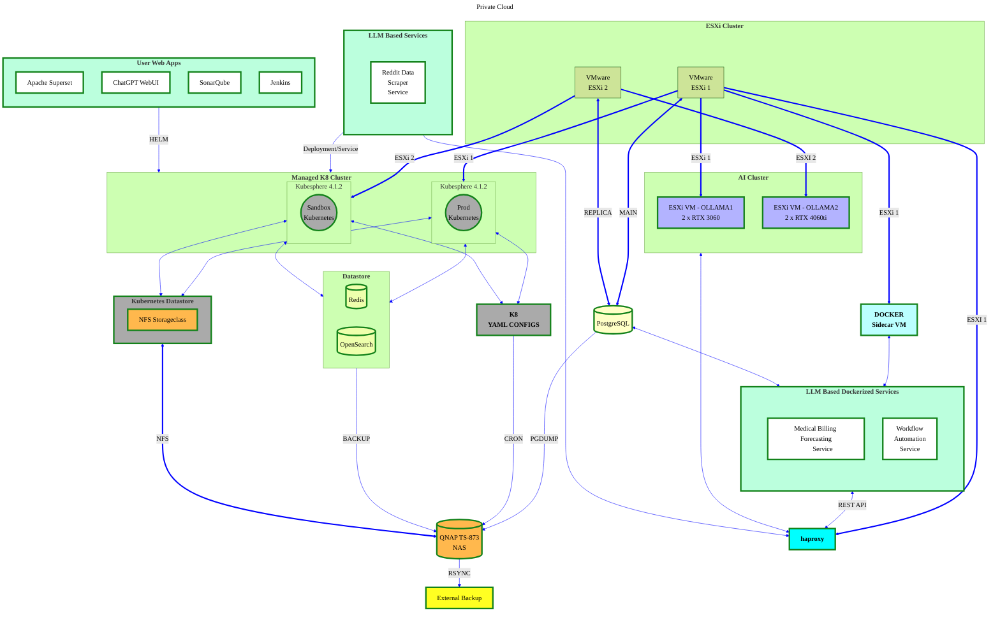

```mermaid
---
title: Private Cloud
---

%%{init: {'theme': 'forest', "loglevel":1,'themeVariables': {'lineColor': 'Blue', 'fontSize':'18px',"fontFamily": "Trebuchet MS"}}}%%

flowchart TD


    style GPU1 fill:#b3b3ff,stroke:#13821a,stroke-width:4px
    style GPU2 fill:#b3b3ff,stroke:#13821a,stroke-width:4px
    style K8_1 fill:#aaaaaa,stroke:#13821a,stroke-width:4px
    style K8_2 fill:#aaaaaa,stroke:#13821a,stroke-width:4px
    style K8STORAGE fill:#aaaaaa,stroke:#13821a,stroke-width:4px
    style K8CONFIG fill:#aaaaaa,stroke:#13821a,stroke-width:4px
    style QNAP fill:#ffb84d,stroke:#13821a,stroke-width:4px
    style NFS fill:#ffb84d,stroke:#13821a,stroke-width:4px
    style PSQL fill:#ffaa,stroke:#13821a,stroke-width:4px
    style REDIS fill:#ffaa,stroke:#13821a,stroke-width:4px
    style ELASTIC fill:#ffaa,stroke:#13821a,stroke-width:4px
    style DOCKER fill:#bbffff,stroke:#13821a,stroke-width:4px
    style APPS fill:#bbffdd,stroke:#13821a,stroke-width:4px
    style SUPERSET fill:#ffffff,stroke:#13821a,stroke-width:4px
    style ChatGPTUI fill:#ffffff,stroke:#13821a,stroke-width:4px
    style SONAR fill:#ffffff,stroke:#13821a,stroke-width:4px
    style JENKINS fill:#ffffff,stroke:#13821a,stroke-width:4px
    style BACKUP fill:#ff0d,stroke:#13821a,stroke-width:4px
    style LLMAPPS fill:#bbffdd,stroke:#13821a,stroke-width:4px
    style LLMAPPSK8 fill:#bbffdd,stroke:#13821a,stroke-width:4px
    style RedditScraper fill:#ffffff,stroke:#13821a,stroke-width:4px
    style MedBillingForecast fill:#ffffff,stroke:#13821a,stroke-width:4px
    style VariousWorkflowAutomation fill:#ffffff,stroke:#13821a,stroke-width:4px
    style HAPROXY fill:#00ffff,stroke:#13821a,stroke-width:4px

    classDef subgraph_padding fill:none,stroke:none
    
    QNAP[(QNAP TS-873
    NAS)]
    HAPROXY["`**haproxy**`"]

    subgraph LLMAPPS["`**LLM Based Dockerized Services**`"]
        subgraph blank[ ]
        direction BT

        MedBillingForecast[Medical Billing Forecasting
        Service]
        VariousWorkflowAutomation[Workflow
        Automation
        Service]
        end
    end

    subgraph LLMAPPSK8["`**LLM Based Services**`"]
        subgraph blank2[ ]
        direction BT
        RedditScraper[Reddit Data
        Scraper
        Service]
        end
    end

    DOCKER["`**DOCKER
    Sidecar VM**`"]
    BACKUP[External Backup]
    K8CONFIG["`**K8 
    YAML CONFIGS**`"]
    PSQL[(PostgreSQL)]

    subgraph VMCLUSTER["`**ESXi Cluster**`"]
        HA[VMware
        ESXi 1]
        HA2[VMware
        ESXi 2]
    end

    subgraph DATASTORE["`**Datastore**`"]
        REDIS[(Redis)]
        ELASTIC[(OpenSearch)]
    end
    subgraph K8["`**Managed K8 Cluster**`"]
        subgraph KS3[Kubesphere 4.1.2]
            K8_1((Prod
            Kubernetes))
        end
        subgraph KS4[Kubesphere 4.1.2]
            K8_2((Sandbox
             Kubernetes))
        end
    end

    subgraph K8STORAGE["`**Kubernetes Datastore**`"]
        NFS[NFS Storageclass]
    end

    subgraph LLM["`**AI Cluster**`"]
        GPU1[ESXi VM - OLLAMA1
        2 x RTX 3060]
        GPU2[ESXi VM - OLLAMA2
        2 x RTX 4060ti]
    end

    subgraph APPS["`**User Web Apps**`"]
        direction BT
        SUPERSET[Apache Superset]
        ChatGPTUI[ChatGPT WebUI]
        SONAR[SonarQube]
        JENKINS[Jenkins]
    end


    
    HA ==ESXi 1==> GPU1
    HA <==MAIN==> PSQL
    HA ==ESXi 1==> KS3
    HA ==ESXi 1==> DOCKER
    HA ==ESXI 1==> HAPROXY

    HA2 ==ESXI 2==> GPU2
    HA2 <==REPLICA===> PSQL
    HA2 ==ESXi 2==> KS4

    DOCKER <--> LLMAPPS <--REST API--> HAPROXY
    LLM <--> HAPROXY

    LLMAPPSK8 --Deployment/Service--> K8
    LLMAPPSK8 --> HAPROXY

    APPS --HELM--> K8

    KS3 <--> K8STORAGE
    KS3 <--> K8CONFIG

    KS3 <--> DATASTORE

    KS4 <--> K8STORAGE
    KS4 <--> K8CONFIG
    KS4 <--> DATASTORE

    QNAP --RSYNC--> BACKUP
    PSQL --PGDUMP--> QNAP

    K8CONFIG --CRON--> QNAP
    DATASTORE --BACKUP---> QNAP
    K8STORAGE <==NFS==> QNAP
    

    
    PSQL <--> LLMAPPS
class blank subgraph_padding
class blank2 subgraph_padding
```

