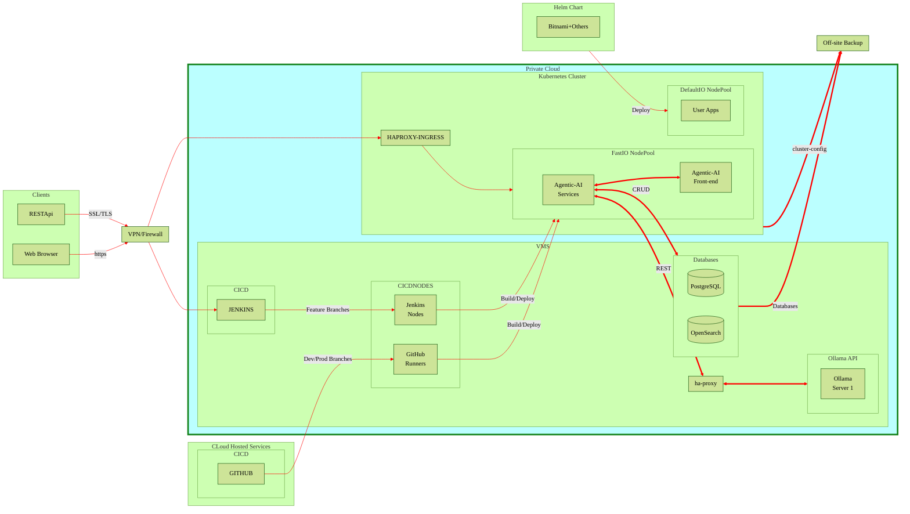

```mermaid
%%{init: {'theme': 'forest', "loglevel":1,'themeVariables': {'lineColor': 'RED',"fontFamily": "Trebuchet MS"}}}%%

graph LR
style PRIVATECLOUD fill:#bbffff,stroke:#13821a,stroke-width:4px
subgraph VPN[VPN/Firewall]
end
subgraph HELM[Helm Chart]
direction RL
    HELMCHARTS[Bitnami+Others]
end
subgraph PRIVATECLOUD[Private Cloud]
subgraph VMS[VMS]
    subgraph CICD[CICD]
        direction RL
        JENKINS
    end
    subgraph CICDNODES[CICDNODES]
        direction BT
        JENKINSNODES[Jenkins
        Nodes]
        GITHUBRUNNERS[GitHub
        Runners]
    end
    subgraph HAPROXY[ha-proxy]
        direction RL
    end
    subgraph OLLAMA[Ollama API]
        OLLAMA1[Ollama
        Server 1]
    end
    subgraph DATA[Databases]
        direction RL
        PSQL[(PostgreSQL)]
        OpenSearch[(OpenSearch)]
    end
end
subgraph K8[Kubernetes Cluster]
    direction RL
    subgraph NODEPOOL1[FastIO NodePool]
        direction BT
        AgenticAI1["Agentic-AI
        Services"]
        AgenticAI2["Agentic-AI
        Front-end"]
    end
    subgraph NODEPOOL2[DefaultIO NodePool]
        UserApps[User Apps]
    end
    subgraph INGRESS[HAPROXY-INGRESS]
    end
end
end
subgraph CLOUD[CLoud Hosted Services]
        subgraph CCICD[CICD]
            GITHUB
        end
end
subgraph BACKUP[Off-site Backup]
end
subgraph CLIENTS[Clients]
    direction BT
    API[RESTApi]
    WEB[Web Browser]
end
AgenticAI1 <==> AgenticAI2
JENKINS --Feature Branches--> JENKINSNODES --Build/Deploy--> NODEPOOL1
GITHUB --Dev/Prod Branches--> GITHUBRUNNERS --Build/Deploy--> NODEPOOL1
INGRESS --> NODEPOOL1
HELM --Deploy--> NODEPOOL2
API --SSL/TLS--> VPN
WEB --https--> VPN
VPN --> INGRESS
VPN --> JENKINS


AgenticAI1 <==CRUD==> DATA
AgenticAI1 <==REST==> HAPROXY <==> OLLAMA

K8 ==cluster-config==> BACKUP
DATA ==Databases==> BACKUP
```
