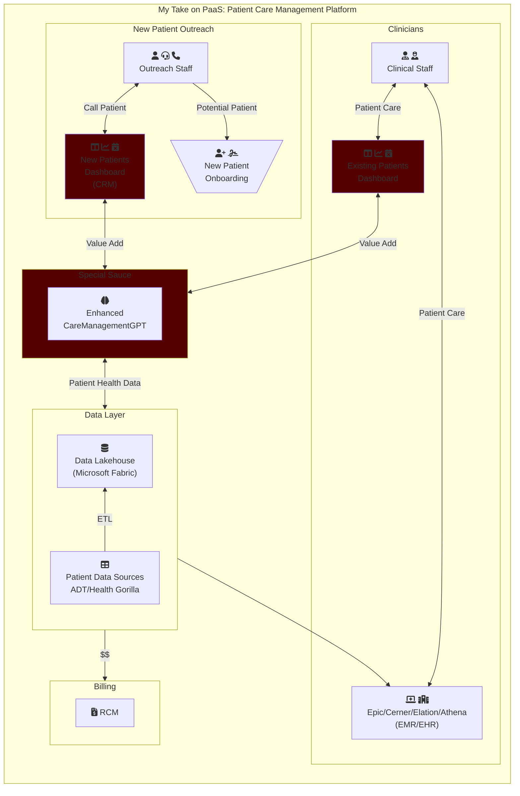

```mermaid
graph TD;
    subgraph main[My Take on PaaS: Patient Care Management Platform]
    direction TB
 
        subgraph Clinicians["Clinicians"]
            direction TB
            style EXISTINGPATDASHBOARD fill:#500
            CLINICALSTAFF[fa:fa-user-md fa:fa-user-nurse
            Clinical Staff] <-- Patient Care --> EXISTINGPATDASHBOARD[fa:fa-columns fa:fa-chart-line fa:fa-calendar-times
            Existing Patients
            Dashboard]
            CLINICALSTAFF <-- Patient Care --> EMR["fa:fa-laptop-medical fa:fa-hospital
            Epic/Cerner/Elation/Athena
            (EMR/EHR)"]
        end

        subgraph NewPatientOutreach[New Patient Outreach]
            direction TB
            style NEWPATDASHBOARD fill:#500
            OUTREACHSTAFF[fa:fa-user fa:fa-headset fa:fa-phone
                Outreach Staff] <-- Call Patient --> NEWPATDASHBOARD["fa:fa-columns fa:fa-chart-line fa:fa-calendar-times
                New Patients
                Dashboard
                (CRM)"]
            OUTREACHSTAFF -- Potential Patient --> ONBOARDING[\fa:fa-user-plus fa:fa-signature
                New Patient
                Onboarding/]
        end

        subgraph DataLayer [Data Layer]
            direction BT
            DATASOURCES[fa:fa-table
            Patient Data Sources
            ADT/Health Gorilla] -- ETL -->  DATALAKEHOUSE["fa:fa-database
            Data Lakehouse
            (Microsoft Fabric)"]
        end

        subgraph AI[Special Sauce]
            style AI fill:#500
            SECRETSAUCE[fa:fa-brain
            Enhanced 
            CareManagementGPT]
        end

        subgraph Billing[Billing]
            RCM[fa:fa-file-invoice-dollar RCM]
        end

        EXISTINGPATDASHBOARD <-- Value Add --> AI
        NEWPATDASHBOARD <-- Value Add --> AI
        AI <-- Patient Health Data --> DataLayer
        DataLayer -- $$ --> Billing
        DataLayer --> EMR

    end
```
