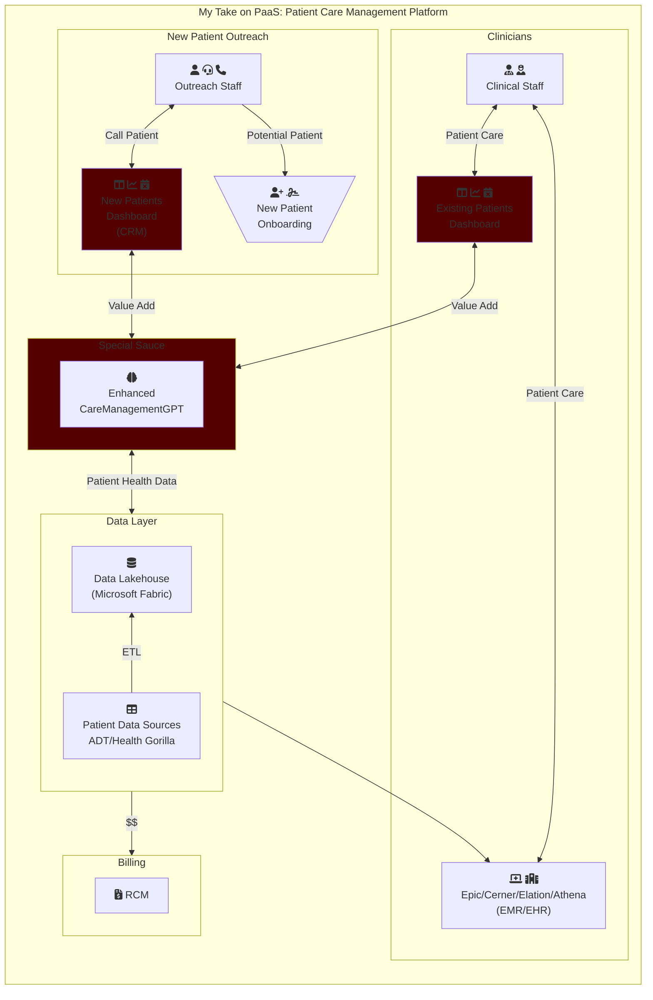

Based on my recent experience in healthcare, I've observed that healthcare platforms are still a work in progress, often appearing as inflexible, disjointed monoliths with integrations haphazardly added, and modularization often an afterthought. Furthermore, integrating post-sales modules is a labor-intensive and resource-consuming task, especially when transitioning from one Electronic Medical Record (EMR) vendor to another.

However, my thoughts returned to the idea of PaaS in the healthcare sector when I learned about Microsoft's introduction of Fabric for Healthcare. Despite the healthcare management technology field being saturated with monolithic systems, I believe that Microsoft Fabric offers new opportunities to address the existing gaps in patient care management technology. Instead of merely using EMR/EHR systems as glorified records of clinician-patient interactions, I envision creating integrations that leverage predictive analytics to significantly enhance patient healthcare outcomes. Within this framework (see diagram), I've identified one specific gap, which I've labeled as the "Special Sauce" within the red box. This service would utilize data analytics to provide a comprehensive insight into a patient's healthcare needs.

Consider a scenario in which a small, rural, or urban hospital network serves an underserved population, treating patients who have previously navigated various healthcare networks. In such cases, patient data analytics can empower clinicians and outreach staff to swiftly outline the patient's healthcare journey, preventing them from bouncing between different healthcare entities.

