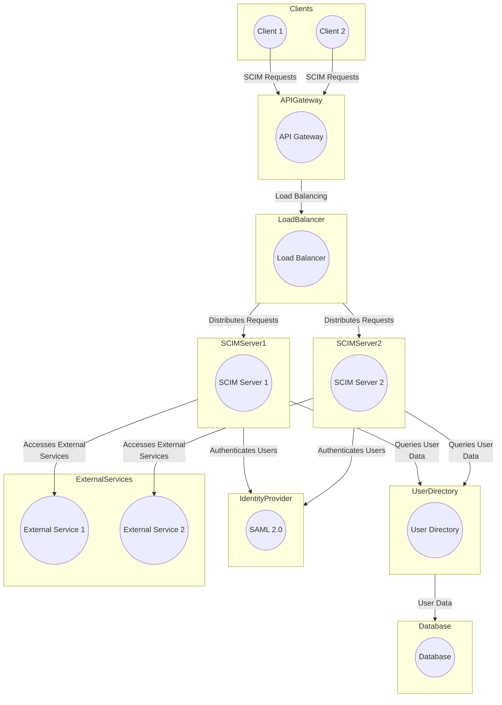

In this architecture, the API Gateway receives SCIM requests from clients and forwards them to a load balancer, which distributes the requests to multiple SCIM servers. The SCIM servers interact with the user directory, SAML 2.0 Identity Provider, external services, and a database as needed to fulfill SCIM requests. This design enables high availability, scalability, and efficient resource utilization in somewhat of a complex SCIM system using SAML 2.0 for authentication:

In this diagram:

- The "Clients" section represents external clients or applications (Client 1 and Client 2) that make SCIM requests.
- The "API Gateway" section represents the API Gateway, which serves as the entry point for SCIM requests and is responsible for load balancing requests.
- The "Load Balancer" section represents a load balancer that distributes incoming SCIM requests to multiple SCIM servers for scalability and redundancy.
- The "SCIM Server 1" and "SCIM Server 2" sections represent multiple SCIM servers handling SCIM operations.
- The "SAML 2.0 Identity Provider" section represents the SAML 2.0 Identity Provider used for user authentication.
- The "User Directory" section represents a user directory or database where user data is stored.
- The "External Services" section represents external services that the SCIM servers may interact with for various tasks.
- The "Database" section represents a database used for storing data related to SCIM operations.

